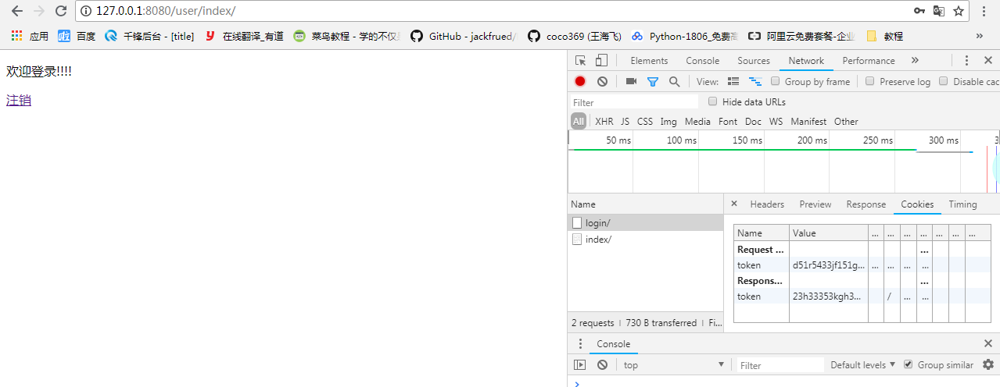

# django5

  今天新建了一个user的应用,主要实现的是注册登录功能

1. 创建数据库中相应的表,一张保存用户注册信息,另一张保存用户登录时校验的标识符,和注册信息是一对一关联关系

```python
from django.db import models

# Create your models here.
class User(models.Model):

    name = models.CharField(max_length=10, unique=True)
    password = models.CharField(max_length=200)
    email = models.CharField(max_length=30, null=True)
    create_time = models.DateTimeField(auto_now_add=True)

    class Meta:
        db_table = 'user'


class UserToken(models.Model):
    #标识符,用于用户访问需要登录验证页面的时候使用,校验标识符是否正确
    token = models.CharField(max_length=30, verbose_name='标识符')
    user = models.OneToOneField(User)

    class Meta:
        db_table = 'user_token'

```

  注:密码字段设置成字符形式,在这里犯了个错误就是把密码设置成了数字类型,导致后面匹配一直不成功,所以要注意.

2. 设置url文件

day05下的urls.py

```python
from django.conf.urls import url, include
from django.contrib import admin

urlpatterns = [
    url(r'^admin/', admin.site.urls),
    url(r'^user/', include('user.urls', namespace='user')),
]

```

user下的urls文件

```python
from django.conf.urls import url

from user import views

urlpatterns = [
    #注册
    url(r'^register/', views.register, name='register'),
    #登录
    url(r'^login/', views.login, name='login'),
    #首页
    url(r'^index/', views.index, name='index'),
    #注销
    url(r'^logout/', views.logout, name='logout'),
]
```

**反向解析**

> 1.定义:
>
>   随着功能增加会出现更多视图,于是就会修改正则表达式,但对应的超链接都要修改,非常麻烦,这时,反向解析就可以让链接根据正则表达式动态生成

>2.应用范围:
>
>- 模板中的超链接
>- 视图中的重定向

>3.使用方法
>
>- 定义url时,需要为include定义namespace属性,为url定义name属性
>- 使用时，在模板中使用url标签，在视图中使用reverse函数，根据正则表达式动态生成地址，减轻后期维护成本。

3. 在views.py文件中新建对应方法

  注册时要对用户名和密码进行三次判断:

​                 (1)判断是否完整----all()函数

​                 (2)判断数据库是否存在该用户----看数据库中是否存在用户名一致的信息

​                 (3)判断两次输入的密码是否一致---if判断

```python

import random

from django.urls import reverse
from django.http import HttpResponseRedirect
from django.shortcuts import render

from user.models import User,UserToken

# Create your views here.
from utils.functions import login_required


def register(request):
    if request.method == 'GET':
        return render(request, 'register.html')

    if request.method == 'POST':
        #用于创建用户
        # 1.获取参数
        name = request.POST.get('name')
        password = request.POST.get('pw')
        password2 = request.POST.get('pw2')
        # 2.校验参数是否完整
        if not all([name, password, password2]):
            msg = '请填写完整的参数'
            return render(request, 'register.html',{'msg':msg})
        # 3. 先判断数据库中是否存在该name用户
        if User.objects.filter(name=name).first():
           msg = '该账号已注册,请去登录'
           return render(request, 'register.html', {'msg':msg})
        # 4. 校验密码是否一致
        if password != password2:
            msg = '密码不一致'
            return render(request, 'register.html', {'msg': msg})
        #5.注册
        User.objects.create(name=name, password=password)
        return HttpResponseRedirect(reverse('user:login'))


```

  登录时也要对用户名和密码进行三次判断,在验证完全正确后,服务器对浏览器进行响应时,向页面中的cookie添加标识符,相当于一个令牌(标识符)

>令牌:
>  1.注册
>  2.登录成功(给一个标识符)
>​      1)登录向页面的cookie中添加标识符:set_cookie(key, value, max_age)
>​      2)向后端的usertoken表中存入这个标识符和登录的用户
>  3.访问任何的路由,先校验你的标识符是否正确,正确则放行,不正确则拒绝访问
>  使用的是闭包(装饰器),拿到request.COOKIES.get('token')
>  4.注销
>​     1) 删除页面cookie中的标识符:delete_cookie(key)
>​     2) 删除后端usertoken表中标识符对应的哪一条数据


```python
def login(request):
    if request.method == 'GET':
        return render(request, 'login.html')

    if request.method == 'POST':
        # 1.获取参数
        name = request.POST.get('name')
        password = request.POST.get('pw')
        #2.验证数据完整性
        if not all([name, password]):
            msg = '请填写完整的登录信息'
            return render(request, 'login.html', {'msg':msg})
        #3.验证用户是否注册
        user = User.objects.filter(name=name).first()
        if not user:
            msg = '该账户没有注册,请去注册'
            return render(request, 'login.html', {'msg':msg})
        #4. 校验密码
        if password != user.password:
            msg = '密码不正确'
            return render(request, 'login.html', {'msg': msg})
        #5.重点
        # 请求与响应:请求是从浏览器发送请求的时候,传递给后端的.
        # 响应:后端返回给浏览器(页面)的
        res = HttpResponseRedirect(reverse('user:index'))
        # set_cookie(key, value, max_age)响应时加一个cookie
        token = ''
        s = '1332543rgfdgskjhgj'
        for i in range(25):
            token += random.choice(s)
        res.set_cookie('token', token, max_age=6000)

        #存token值
        user_token = UserToken.objects.filter(user=user).first()
        if not user_token:
            UserToken.objects.create(token=token, user=user)
        else:
            user_token.token = token
            user_token.save()
        return res


# @login_required
def index(request):
    if request.method == 'GET':
        token = request.COOKIES.get('token')
        #查询标识符是否有效
        user_token = UserToken.objects.filter(token=token).first()
        if not user_token:
            #查询不到信息,说明用户没有登录
            return HttpResponseRedirect(reverse('user:login'))

        return render(request, 'index.html')

# @login_required
def logout(request):
    if request.method == 'GET':
        #1.删除浏览器cookie中的token参数
        res = HttpResponseRedirect(reverse('user:login'))
        res.delete_cookie('token')
        #2.删除UserToken中的数据
        token = request.COOKIES.get('token')
        UserToken.objects.filter(token=token).delete()

        return res
```

4. templates文件中,新建对应的html文件

  register.html

```html


<form method="post">

                用户名:<input name="name" type="text" >

                密码:<input name="pw" type="password" >

                确认密码:<input name="pw2" type="password" >

    <input type="submit" value="提交" >
</form>

```

  login.html

```html



{{ msg }}
<form action="" method="post">
    用户名:<input type="text" name="name" >
    密码:<input type="password" name="pw" >
    <input type="submit" name="提交">

</form>


```

  index.html

```html


    <p>
    欢迎登录!!!!
    </p>
    <a href="" >注销</a>

```

5. 定义登录验证的装饰器

  utils文件夹下的functions.py文件

```python

from django.http import HttpResponseRedirect
#定义登录验证的装饰器
#闭包三个条件:
#1.外层函数套内层函数
#2.内层函数调用外层函数的参数
#3.外层函数返回内层函数
from user.models import UserToken
from django.urls import reverse

def login_required(func):

    def check_login(request):
        #
        token = request.COOKIES.get('token')
        if not token:
            #cookie中没有登录的标识符,跳转到登录
            return HttpResponseRedirect(reverse('user:login'))
        user_token = UserToken.objects.filter(token=token).first()
        if not user_token:
            #token标识符有误,跳转到登录页面
            return HttpResponseRedirect(reverse('user:login'))

        return func(request)

    return check_login
```





