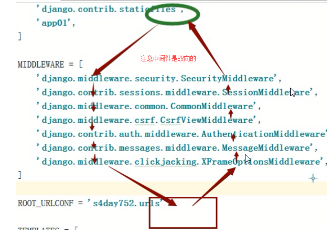

---
author:于梦娇
title:django6
---

# django6

## Form表单,django登录注册功能

**Form表单的功能**

- 自动生成HTML表单元素
- 检查表单数据的合法性
- 数据类型转换(字符类型的数据转换成相应的Python类型)
- 如果验证错误,重新显示表单

  在写登录注册功能时,如果需要验证的参数很多,一个一个验证很麻烦,那么就可以用form表单,帮助验证参数

1. 首先写注册功能

```python
from django import forms
from django.contrib.auth.models import User


class UserRegisterForm(forms.Form):
    # 注册时的验证
    # 表单验证的参数名是与input标签中name属性值相同的参数
    username = forms.CharField(max_length=10, min_length=2,required=True,
                           error_messages={
                               'required':'注册姓名必填',
                               'min_length':'账号不能短于2个字符',
                               'max_length':'账号不能长于10个字符'
                           })
    password = forms.CharField(max_length=10, required=True, error_messages={'required':'密码必填','max_length':'账号不能长于10个字符'})
    password2 = forms.CharField(max_length=10, required=True, error_messages={'required':'确认密码必填','max_length':'账号不能长于10个字符'})


    def clean(self):
        username = self.cleaned_data.get('username')
        # django自带的User模型
        user = User.objects.filter(username=username).first()
        if user:
            # 验证用户名是否已经被注册
            raise forms.ValidationError({'username':'已经注册过'})
        if self.cleaned_data.get('password') != self.cleaned_data.get('password2'):
            # 验证两次输入的密码是否相等
            raise forms.ValidationError({'password':'密码不对'})
        return self.cleaned_data


```

  在forms.py文件中写好后,在views.py文件中,

```python
from django.contrib.auth.decorators import login_required
from django.http import HttpResponseRedirect
from django.shortcuts import render
from django.contrib.auth.models import User
from django.contrib import auth
from django.urls import reverse

from user.forms import UserRegisterForm, UserLoginForm


def register(request):
    if request.method == 'GET':
        return render(request, 'register.html')
    if request.method == 'POST':
        data = request.POST
        # 校验form表单传递的参数
        form = UserRegisterForm(data)
        if form.is_valid():
            # form.is_valid()验证通过返回值True
            password = form.cleaned_data.get('password')
            # User是django自带的模型
            # 引入:from django.contrib.auth.models import User
            # 创建用create_user
            User.objects.create_user(username=form.cleaned_data.get('username'),
                                     password=password)
            return HttpResponseRedirect(reverse('user:login'))
        else:
            return render(request, 'register.html', {'errors':form.errors})
        
        
```

与上一篇内容中提到的用all()来验证参数完不完全相比,all()不知道哪个参数没填,使用form是可以知道的


2. 然后是登录功能,在forms.py文件中

```python
class UserLoginForm(forms.Form):
    # 登录时的验证
    # 表单验证的参数名是与input标签中name属性值相同的参数
    username = forms.CharField(max_length=10, min_length=2, required=True,
                               error_messages={
                                   'required': '注册姓名必填',
                                   'min_length': '账号不能短于2个字符',
                                   'max_length': '账号不能长于10个字符'
                               })
    password = forms.CharField(max_length=10, required=True,
                               error_messages={'required': '密码必填', 'max_length': '账号不能长于10个字符'})


    def clean(self):
        user = User.objects.filter(username=self.cleaned_data.get('username')).first()
        if not user:
            raise forms.ValidationError({'username':'该账号没有注册,请去注册'})

        return self.cleaned_data
```

在views.py文件中,验证用户名和密码用到 authenticate()函数

  authenticate(username,password)函数需要两个参数username，password，如果校验通过则返回User对象，如果校验不通过返回None

  login接受两个参数，第一个是request对象，第二个是user对象。login方法使用SessionMiddleware将userID存入session当中。注意，在用户还未登录的时候，也存在着匿名用户的Session，在其登陆之后，之前在匿名Session中保留的信息，都会保留下来。这两个方法要结合使用，而且必须要先调用authenticate()，因为该方法在User的一个属性中纪录了该用户已经通过校验，这个属性会被随后的login过程所使用

```python
def login(request):
    if request.method == 'GET':
        return render(request, 'login.html')
    if request.method == 'POST':
        data = request.POST
        form = UserLoginForm(data)
        if form.is_valid():
            # 使用的是django自带的auth.authenticate(),去数据库中验证用户名,密码是否正确
            user = auth.authenticate(username=self.cleaned_data.get('username'),
                                    password=self.cleaned_data.get('password'))
            if user:
                # 登录时,向request.user赋值,赋值为登录系统的用户对象
                # 1.向页面的cookie中设置sessionid值(标识符)
                # 2.向django_session表中设置sessoin_key字段值
                # 上一篇中使用的是set_cookie方法添加标识符(token)
                # 这次使用的是django自带的auth.login()添加标识符
                auth.login(request, user)
                return HttpResponseRedirect(reverse('user:index'))
            else:
                return render(request, 'login.html', {'msg':'密码错误'})
        else:
            return render(request, 'login.html', {'errors':form.errors})

# django自带的装饰器
@login_required
def index(request):
    if request.method == 'GET':
        return render(request, 'index.html')

@login_required
def logout(request):
    if request.method == 'GET':
        #研究logout实现的功能
        auth.logout(request)
        return HttpResponseRedirect(reverse('user:login'))
```

>我们也可以不用authenticate()进行特定于一个用户的身份校验，直接使用和User无关的几个函数进行密码相关的校验，在Django1.4中以及新版本中提供以下方法，
>
>在模块django.contrib.auth.hashers中：
>
>1. check_password(password,encoded):
>
>   第一个参数是明文密码，第二个参数是加密过的密码。如果通过校验返回True，不通过返回False；　　
>
>2. make_password(password[,salt,hashers]):
>
>   根据给定的明文密码，salt，和Django支持的加密算法，返回一个加密的密码。如果password提供的值为None，那么该返回值将永远通不过check_password()方法。这个返回值是一个特定的约定值，目前是'!';
>
>3. is_password_usable(encoded_password):
>
>   判断是否给定字符串是一个hashed密码，有机会通过check_password()函数的校验。

   我们使用django.contrib.auth.logout函数来登出用django.contrib.auth.login函数登入的用户。

logout(requet)函数只有一个参数，就是request。没有返回值，而且即使当前用户没有登陆也不会抛出任何异常。

这个方法，会将存储在用户session的数据全部清空，这样避免有人用当前用户的浏览器登陆然后就可以查看当前用户的数据了，回想一下login会保留anonymous用户的session数据。如果需要将一些东西加入到登出之后的用户session，那么需要在logout方法调用之后再进行。


## 中间件

  中间件是帮助我们在视图函数执行之前和执行之后都可以做一些额外的操作,它本质上就是几个方法,Django框架会在请求的特定时间去执行这些方法.面向切面编程

>```
>url-->views视图函数-->model-->templates
>拦截1:     在url中拦截process_request方法(常用),判断标识符
>拦截2:     process_views
>拦截3:     process_templates
>拦截4:     process_response(常用)
>```

设置一个middleware.py文件

```python
from django.utils.deprecation import MiddlewareMixin


class TestMiddleware(MiddlewareMixin):


    def process_request(self, request):
        print('process_request1')
        #继续执行对应的视图函数
        return None

    def process_response(self, request, response):
        print('process_response1')
        #返回响应
        return response

class Test2Middleware(MiddlewareMixin):

    def process_request(self, request):
        print('process_request2')
        # 继续执行对应的视图函数
        return None

    def process_response(self, request, response):
        print('process_response2')
        # 返回响应
        return response
    
当有两个定义中间件时,先执行process_request1,process_request2,proce,ss_response2,process_response1

```

  中间件的执行如图所示:




每一个请求都是先通过中间件中的 process_request 函数，这个函数返回 None 或者 HttpResponse 对象，如果返回前者，继续处理其它中间件，如果返回一个 HttpResponse，就处理中止，返回到网页上。